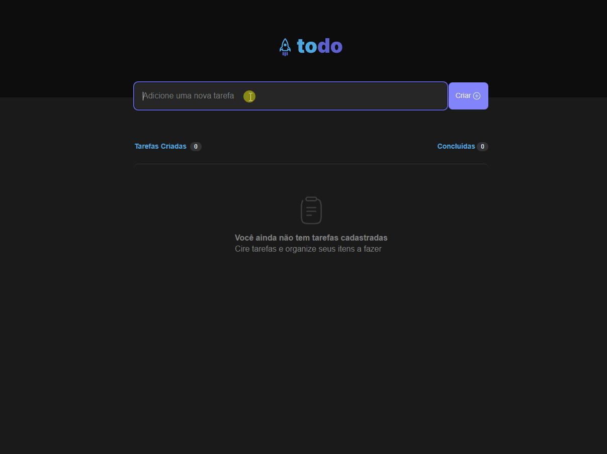

<h1 align="center"></h1>

ToDo List é uma página web para criação e controle de tarefas.

## 🎦 Demonstração




## ⚙️ Funcionalidades

- Adicionar uma nova tarefa
- Marcar e desmarcar uma tarefa como concluída
- Remover uma tarefa da listagem
- Mostrar o progresso de conclusão das tarefas

## 🚀 Rodando localmente

Clone o projeto

```bash
  git clone https://github.com/juliaaoliveeirs/ignite-todo
```

Entre no diretório do projeto

```bash
  cd ignite-todo
```

Instale as dependências

```bash
  npm install
```

Inicie o servidor

```bash
  npm run start
```

O app estará disponível no seu browser pelo endereço http://localhost:5173.

## 🧪 Stack utilizada

Esse projeto foi desenvolvido com as seguintes tecnologias:

- [React](https://reactjs.org)
- [TypeScript](https://www.typescriptlang.org/)

## 🔗 Link do projeto

Se quiser ver o projeto no ar, clique [aqui](https:/ignite-todo.vercel.app).

## 📝 License

Esse projeto está sob a licença MIT. Veja o arquivo
[LICENSE](https://choosealicense.com/licenses/mit/) para mais detalhes.
